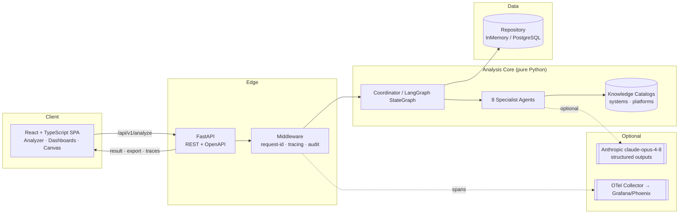
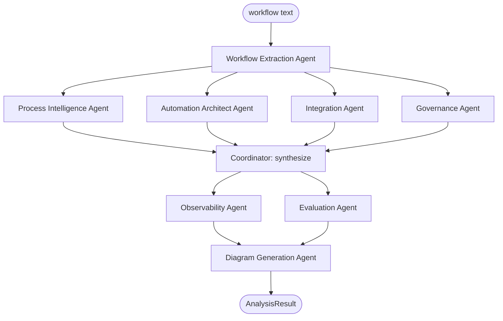

# Workflow Intel — Architecture

This document is the architectural source of truth. It covers the system decomposition, the
multi-agent pipeline, the domain model, the orchestration strategy, observability, governance,
persistence, and the API surface.

---

## 1. System context



The platform is a **read-mostly analysis service**: a request carries a workflow description,
the core runs a deterministic (optionally LLM-augmented) multi-agent pipeline, and the result is
persisted and returned. There is no long-lived agent loop in the request path — analysis is a
bounded DAG, which keeps latency, cost, and failure modes predictable (an explicit design choice
over an open-ended agent that the spec warns against).

---

## 2. Layered decomposition

```
api/            HTTP boundary — DTOs, routes, middleware. Knows nothing about heuristics.
agents/         Specialist agents + Coordinator. Orchestrates domain transformations.
graph/          Optional LangGraph adapter over the same agent callables.
analysis/       Deterministic extraction & scoring heuristics (the "brain" w/o an LLM).
knowledge/      Curated catalogs: enterprise systems, automation platforms, MCP metadata.
llm/            Provider abstraction. AnthropicProvider | NullProvider. Structured outputs.
observability/  Tracing (OTel bridge + in-memory recorder), metrics, cost model.
domain/         Pydantic models + enums. The contract shared by every layer and the frontend.
persistence/    Repository protocol; InMemory + SQLAlchemy implementations; DDL.
export/         Canonical JSON/YAML automation-spec serializers.
```

Dependencies point inward: `api → agents → analysis/knowledge/llm → domain`. `domain` depends on
nothing. This keeps the domain model portable (it is mirrored as TypeScript types in the frontend).

---

## 3. The domain model (the contract)

Everything the platform produces is an `AnalysisResult`, an aggregate of strongly-typed Pydantic
models. The headline members:

```
AnalysisResult
├── id, created_at, source_text, engine (deterministic|llm), model
├── process_report : ProcessIntelligenceReport
├── workflow       : WorkflowGraph(nodes: [WorkflowNode], edges: [WorkflowEdge])
├── bottlenecks    : [Bottleneck]            # human | system | ai_candidate (+ scores, ROI)
├── automations    : [AutomationRecommendation]   # per step: type + platform + reasoning
├── agents         : [AgentDesign]           # full agent specs
├── integrations   : [Integration]           # API/auth/events/webhooks/MCP
├── governance     : [GovernanceClassification]
├── risks          : [RiskItem]              # 6 categories × severity × likelihood
├── observability  : ObservabilitySpec
├── evaluation     : [EvaluationSpec]
├── diagrams       : {system,agent,data_flow,sequence,integration: mermaid}
└── trace          : [AgentTrace]            # captured span per agent
```

The aggregate serializes losslessly to the JSON/YAML export schema (see `docs/export-schema.md`).

---

## 4. Multi-agent pipeline

Eight specialist agents plus a coordinator. Each agent is a class implementing
`async def run(state) -> state'`, instrumented by the tracing decorator.



| Agent | Reads | Produces |
| --- | --- | --- |
| **Workflow Extraction** | raw text | steps, actors, systems, handoffs → `WorkflowGraph` |
| **Process Intelligence** | graph | `ProcessIntelligenceReport` + bottlenecks |
| **Automation Architect** | graph + bottlenecks | `AutomationRecommendation[]` + candidate `AgentDesign[]` |
| **Governance** | graph + automations | `GovernanceClassification[]` + `RiskItem[]` |
| **Integration** | systems | `Integration[]` (API/auth/events/webhooks/MCP) |
| **Observability** | agents + automations | `ObservabilitySpec` |
| **Evaluation** | agents + automations | `EvaluationSpec[]` |
| **Diagram Generation** | full result | five Mermaid diagrams |

After the parallel analysis fan-out, the **Coordinator** merges agent outputs, resolves
cross-references (e.g., linking an `AgentDesign` to the bottleneck that justifies it), and runs
the synthesis agents.

### Orchestration: Coordinator vs LangGraph

`agents/coordinator.py` is the canonical orchestrator: it runs extraction, fans out the four
analysis agents with `asyncio.gather`, then runs synthesis. `graph/langgraph_flow.py` builds an
equivalent `langgraph.StateGraph` whose nodes delegate to the *same* agent instances — so when
LangGraph is installed the pipeline executes as a true `StateGraph`, and when it is not, the
Coordinator runs unchanged. Both share one `PipelineState`.

---

## 5. LLM layer

`llm/provider.py` defines `LLMProvider` with one method: `structured(prompt, schema) -> dict`.

- **`NullProvider`** — always signals "unavailable"; agents fall back to deterministic heuristics.
- **`AnthropicProvider`** — uses the Anthropic SDK, model `claude-opus-4-8`, adaptive thinking,
  and **structured outputs** (`output_config.format` / `messages.parse`) so the model returns
  data that validates directly against the domain Pydantic schema. Prompt-cached system context.

Provider selection is config-driven (`WI_LLM_ENABLED`, `ANTHROPIC_API_KEY`). Agents call the
provider and validate the response; on any failure they degrade to the deterministic path. This
makes the LLM strictly additive — it never reduces reliability.

---

## 6. Observability

`observability/tracing.py` exposes a `trace_agent` async context manager that opens a span,
records inputs/outputs/latency, and estimates token & dollar cost. It writes to OpenTelemetry
when an SDK is configured **and** to an in-process `SpanRecorder`. The recorder's spans become
`AgentTrace` objects on the result and are returned by `GET /analyses/{id}/traces`, so the
observability story is verifiable without standing up a collector.

Captured per span: `trace_id`, `span_id`, `agent`, `status`, `started_at`, `latency_ms`,
`token_estimate`, `cost_usd_estimate`, `error`. See `docs/observability.md`.

---

## 7. Governance & risk

The Governance Agent classifies every step into one of four tiers — **Safe for Full Automation**,
**Human Approval Required**, **Human Review Recommended**, **Prohibited Automation** — using a
rules matrix over step features (financial impact, external communication, irreversibility, PII,
regulatory surface). It independently produces a risk register across six categories
(hallucination, data leakage, compliance, PII, financial, operational), each scored by severity
and likelihood with a concrete mitigation. See `docs/governance.md`.

---

## 8. Persistence

`persistence/repository.py` declares an `AnalysisRepository` protocol (`save`, `get`, `list`).
`InMemoryRepository` is the default. `persistence/sql.py` provides an async SQLAlchemy
implementation and `persistence/ddl.sql` the PostgreSQL schema (analyses + audit_log + traces).
See `docs/database.md`.

---

## 9. API surface

```
POST   /api/v1/analyze                      run pipeline → AnalysisResult
GET    /api/v1/analyses                      list summaries
GET    /api/v1/analyses/{id}                 fetch full result
GET    /api/v1/analyses/{id}/export          ?format=json|yaml  (download)
GET    /api/v1/analyses/{id}/diagram/{kind}  mermaid text
GET    /api/v1/analyses/{id}/traces          captured agent traces
GET    /api/v1/meta                          capabilities + provider/engine status
GET    /api/v1/health                        liveness
```

Middleware adds a request id, opens a root trace span, and writes an audit-log entry per
mutating call. Full reference in `docs/api.md`.

---

## 10. Quality & testing

- Pydantic v2 validation at every boundary.
- `pytest` suite covering extraction, the full pipeline, governance classification, export
  round-tripping, and the API.
- The deterministic core makes every test hermetic (no network, no keys).

See [`docs/roadmap.md`](./docs/roadmap.md) for what a v2 would add (vector retrieval over a process
library, simulation/what-if, live execution against the recommended platforms).
