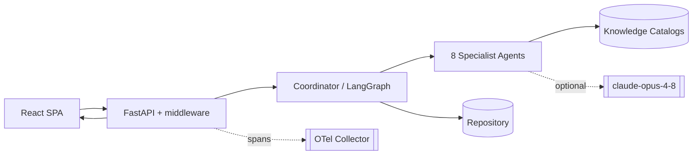
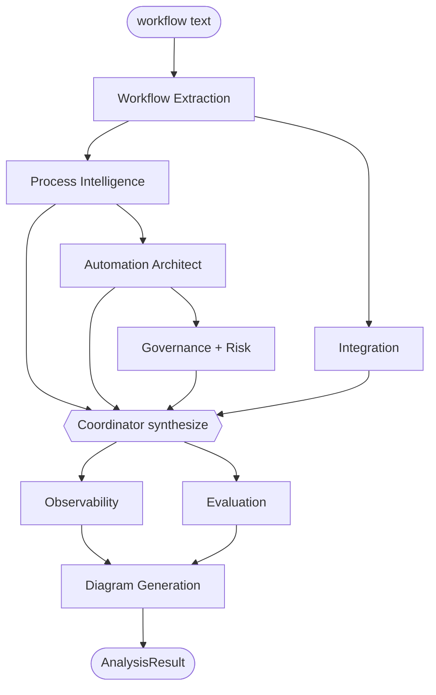
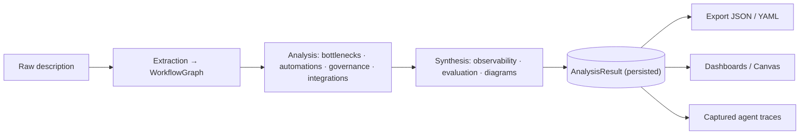
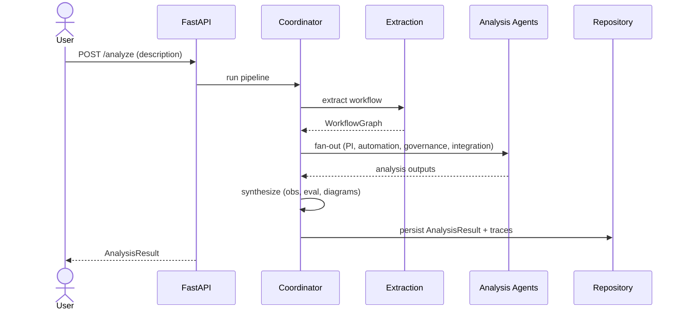

# Architecture Diagrams

The Diagram Generation Agent emits five Mermaid diagrams **per analysis** (system, agent,
data-flow, sequence, integration) plus the workflow DAG — fetch them at
`GET /analyses/{id}/diagram/{kind}` or view them on the Architecture Canvas. The system/agent/
data-flow/sequence templates below are the static platform views; the integration and workflow
diagrams are fully data-driven from each result.

## System architecture


## Agent architecture


## Data flow


## Sequence


## Integration (example — generated per analysis)
```mermaid
flowchart LR
    WI(["Workflow Intel"])
    NSalesforce["Salesforce<br/>CRM"]
    WI <-->|OAuth 2.0 (JWT bearer)| NSalesforce
    NSlack["Slack<br/>Messaging"]
    WI <-->|OAuth 2.0 (bot token)| NSlack
    NSharePoint["SharePoint<br/>Document Management"]
    WI <-->|OAuth 2.0 (Microsoft Entra ID)| NSharePoint
```
